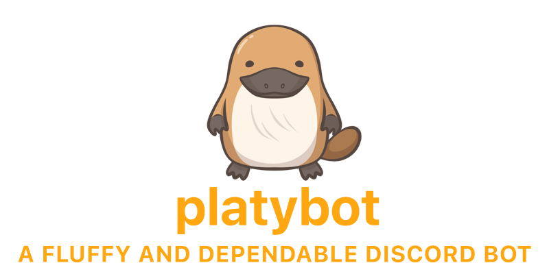

  

 

 

**Platybot** is a fully-featured `C#` bot with eventual `IPC` capabilities allowing for `plugin` creation with `Python`.

*This is only the HEAD of the repository. The full version history (4 years worth) will be published soon.*

